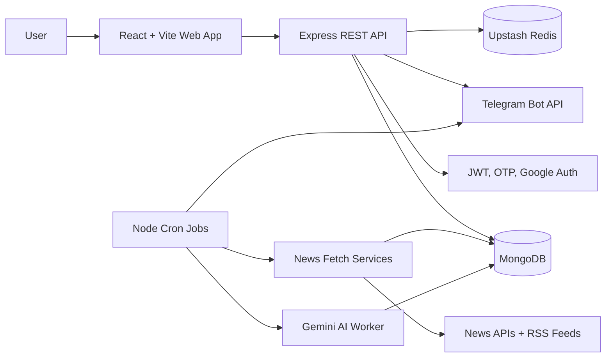

# NewsMint

> A personalized AI-powered news assistant that collects news from multiple providers, creates concise summaries, and delivers a user-specific digest through a web dashboard and Telegram.

## Project Overview

NewsMint is a full-stack news aggregation and personalization platform. Users create an account, choose their preferred categories, language, sources, delivery time, and timezone, then read a personalized feed in the web application or receive an automated digest in Telegram.

The project demonstrates backend API design, authentication, third-party API integration, scheduled background processing, AI-assisted content transformation, caching, and a responsive React user experience.

## Why This Project Matters

The product solves a practical information-overload problem:

- It brings articles from news APIs and RSS feeds into one system.
- It removes duplicate stories using normalized URLs, titles, and content hashes.
- It uses Google Gemini to generate summaries and key points in English and Hindi.
- It filters the final feed using each user's preferences.
- It sends a readable digest to Telegram at the user's selected delivery time.

## Main User Journey

1. A user registers with email and OTP verification, logs in, or uses Google authentication.
2. The user selects categories, preferred news sources, language, delivery time, and timezone.
3. The user optionally connects a Telegram account through the NewsMint bot.
4. The backend fetches and normalizes news from configured APIs and RSS sources.
5. Duplicate articles are rejected before they are stored in MongoDB.
6. The AI worker summarizes new articles and extracts key points.
7. The dashboard displays the user's personalized news feed.
8. The digest scheduler sends recent matching articles to Telegram and calculates the next delivery time.

## Architecture



## Technology Stack

### Frontend

- React 19 with Vite
- React Router for public, authentication, onboarding, and dashboard routes
- Axios service modules for API communication
- `@react-oauth/google` for Google sign-in
- Lucide React for interface icons
- Sonner for toast notifications

### Backend

- Node.js with ES modules
- Express 5 REST API
- MongoDB with Mongoose for users, preferences, sources, and news articles
- Upstash Redis for short-lived Telegram connection state and caching support
- JWT authentication stored through HTTP cookies
- OTP email workflows using Nodemailer and SMTP
- Google authentication using Google Auth Library
- Express Validator and route-specific rate limiting
- CORS and cookie parsing for frontend integration

### Data and automation

- RSS Parser for feed ingestion
- GNews, NewsData.io, and MediaStack integrations
- Google Gemini for article summaries and key-point extraction
- Node Cron for news processing and scheduled user digests
- Telegram Bot API for account linking and digest delivery
- Luxon for timezone-aware digest scheduling

## Repository Structure

```text
AI-News-assistent/
├── Backend/
│   ├── server.js                         # Application startup and services
│   └── src/
│       ├── app.js                         # Express middleware and route registration
│       ├── config/                        # Environment, mail, Redis configuration
│       ├── db/                            # MongoDB connection
│       ├── Feature/Auth/                  # Registration, login, OTP, Google auth, JWT
│       ├── Feature/Prefrence/              # User news and delivery preferences
│       ├── Feature/NewsSource/             # Source catalogue and user selections
│       ├── Feature/NewsForWeb/             # Personalized dashboard news endpoint
│       ├── NewsArticle/                    # Fetching, deduplication, storage, AI processing
│       ├── Scheduler/                     # News, digest, worker, and cleanup jobs
│       └── TelegramBOT/                   # Bot polling, account linking, and messaging
└── Frontend/newsMint/
	└── src/
		├── Components/AuthPage/            # Login, registration, OTP, Google auth
		├── Components/PrefrenceForm/      # Onboarding and digest configuration
		├── Components/Dashboard/           # Feed, sources, and top-news views
		├── Components/Pages/               # Route-level page composition
		├── security/                       # Protected route behavior
		└── services/                       # Axios API service modules
```

## Backend API Surface

All routes are mounted under `/api`. Authenticated routes require the JWT cookie.

| Area | Endpoints | Purpose |
| --- | --- | --- |
| Authentication | `POST /auth/register`, `POST /auth/verify-otp` | Register and verify a user |
| Authentication | `POST /auth/login`, `POST /auth/google` | Password or Google login |
| Authentication | `GET /auth/me`, `GET /auth/profile`, `GET /auth/logout` | Session and profile operations |
| Password recovery | `POST /auth/forgot-password`, `POST /auth/verify-reset-otp`, `POST /auth/reset-password` | Reset a forgotten password |
| Preferences | `POST /preferences/save-preferences`, `GET /preferences/me` | Complete onboarding and check setup state |
| Preferences | `GET /preferences/dashboard`, `PUT /preferences/update-preferences` | Read and update preferences |
| Sources | `GET /sources/all-sources`, `GET /sources/my-sources` | Browse and inspect sources |
| Sources | `POST /sources/select`, `DELETE /sources/select/:sourceId` | Manage selected sources |
| News | `GET /news/my-news` | Load the personalized news feed |
| Telegram | `GET /telegram/connect`, `GET /telegram/status` | Start and inspect Telegram linking |
| Telegram | `POST /telegram/webhook` | Receive Telegram bot updates |

## Automated News Pipeline

The backend startup initializes MongoDB, Redis, Telegram polling, and scheduled jobs. The news pipeline then:

1. Fetches articles by category from API and RSS providers.
2. Validates the configured source and category mapping.
3. Normalizes URLs by removing tracking parameters.
4. Normalizes titles and removes duplicates across providers.
5. Stores unique articles with a SHA-256 content hash.
6. Sends unprocessed articles to the Gemini AI worker.
7. Stores English/Hindi summaries and key points.
8. Deletes old news according to the cleanup service.

The digest pipeline runs independently. It finds completed preferences whose `nextDeliveryAt` is due, selects recent AI-processed articles, applies source and category filters, formats the digest in the user's language, splits long messages to respect Telegram limits, sends the chunks, and calculates the next delivery timestamp.

## Local Development

### Prerequisites

- Node.js 18 or newer
- MongoDB database
- Upstash Redis database
- Telegram bot created through BotFather
- SMTP account for OTP emails
- API keys for the selected news providers and Gemini

### Start the backend

```bash
cd Backend
npm install
npm run dev
```

### Start the frontend

```bash
cd Frontend/newsMint
npm install
npm run dev
```

The Vite development server normally runs on `http://localhost:5173`. The backend port is controlled by `PORT`.

### Environment variables

Create a local `.env` file in `Backend/`. Never commit real credentials.

```env
PORT=5000
MONGO_URI=your_mongodb_connection_string
BACKEND_URL=http://localhost:5000
FRONTEND_CLIENT_ID=http://localhost:5173

UPSTASH_REDIS_REST_URL=your_upstash_url
UPSTASH_REDIS_REST_TOKEN=your_upstash_token

SMTP_HOST=your_smtp_host
SMTP_PORT=587
SMTP_USER=your_smtp_user
SMTP_PASS=your_smtp_password
EMAIL_USER=your_sender_email

MEDIASTACK_API_KEY=your_mediastack_key
NEWSDATA_API_KEY=your_newsdata_key
GNEWS_API_KEY=your_gnews_key

GEMINI_API_KEY_1=your_gemini_key
GEMINI_API_KEY_2=your_gemini_key
GEMINI_API_KEY_3=your_gemini_key

TELEGRAM_BOT_TOKEN=your_telegram_bot_token
TELEGRAM_BOT_USERNAME=your_bot_username
```

## Frontend Routes

- `/`: public landing page
- `/authantication-page`: login and registration
- `/preference`: protected onboarding flow for new users
- `/home-page`: protected personalized dashboard
- `/home-page/source`: source management view
- `/home-page/top-news`: top-news view
- `/privacy-policy` and `/terms-of-service`: legal pages

Protected route guards keep unauthenticated users out of the dashboard and guide authenticated users through preferences before showing personalized content.

## Engineering Highlights

- Modular feature-based backend organization instead of a single large controller.
- Provider adapter pattern: multiple news providers expose a common fetcher contract.
- Defensive ingestion with URL normalization, title normalization, content hashing, and source validation.
- Security controls including validation, JWT middleware, cookies, CORS configuration, and rate limits on sensitive auth endpoints.
- Asynchronous background work separated from request/response handling.
- Language-aware content selection for English and Hindi summaries.
- Telegram message splitting so generated digests remain within platform limits.
- Timezone-aware delivery scheduling for users in different locations.

## Current Development Notes

NewsMint is actively under development. Before production deployment, the project should add a complete automated backend test suite, formal API documentation, stronger centralized error handling and observability, production-ready webhook configuration, and deployment-specific scheduler configuration. The current backend package still contains a placeholder `npm test` script, so tests should be run from the individual test files or wired into a proper test runner.


