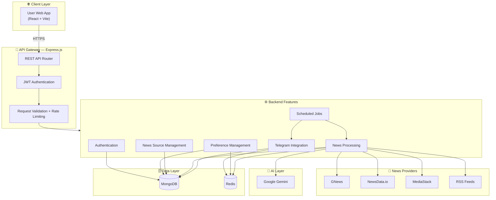
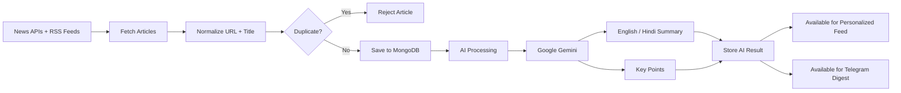
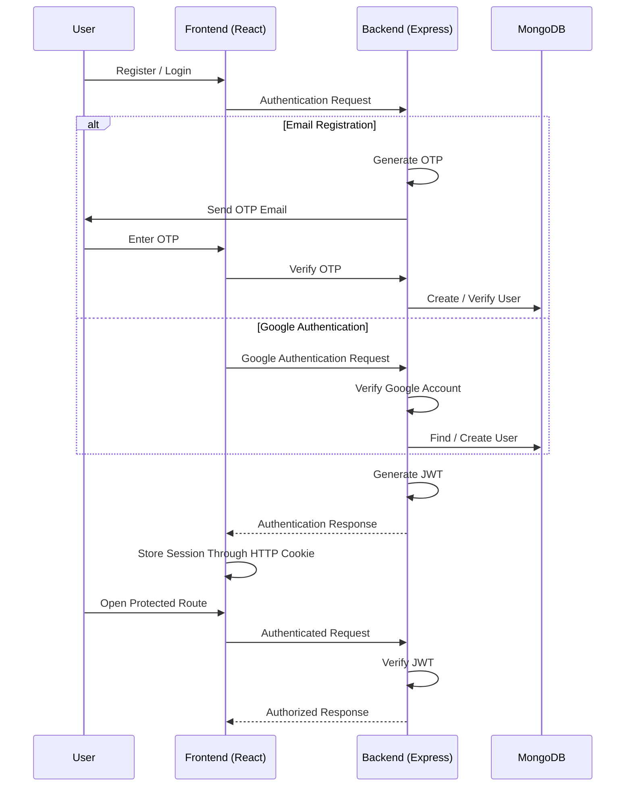
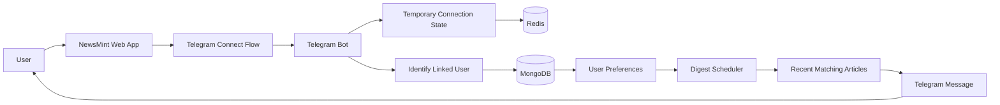

<div align="center">

# 📰 NewsMint

### AI-Powered Personalized News Assistant

Get the news that matters to you — summarized, personalized, and delivered when you want it.

[](https://news-mint.vercel.app/)
[](https://github.com/MohammadMustafa23/NewsMint)
[](#-license)


</div>

## 📖 About the Project

**NewsMint** is a full-stack AI-powered news aggregation and personalization platform that collects articles from multiple news providers and RSS feeds, processes them using Google Gemini, and delivers a personalized news experience through a web dashboard and Telegram.

Instead of forcing users to manually search through different news platforms, NewsMint lets users define their **categories, preferred sources, language, delivery time, and timezone** once and then automatically builds their personalized news feed and scheduled digest.

🔗 **Try it live:** [news-mint.vercel.app](https://news-mint.vercel.app/)

## ❗ Problem Statement

* People often want to **read the latest news**, but finding the news they actually care about can take unnecessary effort.
* Searching for news **category by category** is inconvenient when a user regularly follows specific topics.
* Normal news websites and apps provide a large amount of content, but users may not want to repeatedly open different platforms and **search for the stories that interest them**.
* A user may be free to read news at a particular time, but the news they want is not automatically waiting for them in one place.
* Users may prefer receiving news directly through platforms they already use, such as **Telegram**, instead of opening a separate news application every time.
* After reading a summary, users may still want to read the **original article**, but switching between platforms and finding the original source adds another step.

## 💡 Solution

NewsMint changes the experience from **"search for news when you need it"** to **"receive your personalized news when you are ready to read it."**

1. User selects the **categories and news sources** they are interested in.
2. User selects their preferred **language, delivery time, and timezone**.
3. NewsMint collects relevant articles from configured news APIs and RSS feeds.
4. The system removes duplicate stories and processes new articles using **Google Gemini** to generate concise summaries and key points.
5. At the user's selected delivery time, NewsMint prepares a personalized digest containing the news that matches their preferences.
6. The digest is delivered directly to the user's **Telegram**, so the user can simply open Telegram and start reading instead of searching across other platforms.
7. Each news item can lead the user to the **original article**, allowing them to read the complete story from the actual source.
8. Users can also read their personalized news directly through the **NewsMint web application**.
9. **WhatsApp delivery is planned as a future feature**, depending on the availability of the required WhatsApp API access.

```text
Choose Interests
      ↓
NewsMint Collects Relevant News
      ↓
Remove Duplicates
      ↓
Gemini Summarizes News
      ↓
User's Selected Delivery Time
      ↓
Personalized Digest
      ↓
Telegram
      ↓
Read News → Open Original Article
```

## ✨ Key Features

| Feature                      | Description                                                                                     |
| ---------------------------- | ----------------------------------------------------------------------------------------------- |
| 🧠 AI-Powered Summaries      | Google Gemini generates concise summaries and key points from collected articles                |
| 📰 Multi-Provider News       | Collects news from GNews, NewsData.io, MediaStack, and RSS feeds                                |
| 🎯 Personalized Feed         | Filters news according to each user's selected categories and sources                           |
| 🌐 Multi-Language            | Supports English and Hindi news content                                                         |
| 🔁 Duplicate Detection       | Prevents duplicate stories using normalized URLs, normalized titles, and content hashes         |
| ⏰ Scheduled Digests          | Automatically prepares and sends personalized news digests at the user's selected delivery time |
| 🌍 Timezone-Aware Scheduling | Calculates delivery times according to the user's selected timezone                             |
| 📱 Telegram Bot Integration  | Users can connect their Telegram account and receive scheduled news digests                     |
| 🔐 Secure Authentication     | Email registration, OTP verification, password login, Google authentication, and JWT sessions   |
| ⚡ Redis Caching              | Uses Redis for caching support and short-lived Telegram connection state                        |
| 🛡 Rate Limiting             | Sensitive authentication routes are protected using route-specific rate limits                  |
| 📱 Responsive UI             | React-based interface for browsing personalized news                                            |
| 🧹 News Cleanup              | Old news is removed according to the cleanup process                                            |

## ⚙ How It Works

```text
Sign Up → Set Preferences → Fetch News → Remove Duplicates → Gemini Processing
→ Personalized Feed → Connect Telegram → Scheduled Digest
```

---

## 🏗 System Architecture


```mermaid
flowchart TB

    subgraph Client["🌐 Client Layer"]
        UserUI["User Web App<br/>(React + Vite)"]
    end

    subgraph Gateway["🚪 API Gateway — Express.js"]
        Router["REST API Router"]
        AuthMW["JWT Authentication"]
        Validate["Request Validation + Rate Limiting"]
    end

    subgraph Backend["⚙ Backend Features"]
        Auth["Authentication"]
        Preference["Preference Management"]
        Source["News Source Management"]
        News["News Processing"]
        Telegram["Telegram Integration"]
        Scheduler["Scheduled Jobs"]
    end

    subgraph Providers["📰 News Providers"]
        GNews["GNews"]
        NewsData["NewsData.io"]
        MediaStack["MediaStack"]
        RSS["RSS Feeds"]
    end

    subgraph AI["🤖 AI Layer"]
        Gemini["Google Gemini"]
    end

    subgraph Storage["🗄 Data Layer"]
        Mongo[("MongoDB")]
        Redis[("Redis")]
    end

    UserUI -->|HTTPS| Router
    Router --> AuthMW --> Validate --> Backend

    Auth --> Mongo
    Preference --> Mongo
    Source --> Mongo
    News --> Mongo
    News --> Gemini

    Scheduler --> News
    Scheduler --> Telegram

    News --> GNews
    News --> NewsData
    News --> MediaStack
    News --> RSS

    Telegram --> Redis
    Telegram --> Mongo

    Preference --> Redis
    News --> Redis
```

**Layer breakdown:**

* **Client Layer** — React + Vite provides the web interface for authentication, onboarding, personalized news, and source selection.
* **API Gateway** — Express handles routing, authentication middleware, validation, cookies, CORS, and route-specific rate limiting.
* **Backend Features** — authentication, preferences, sources, news processing, Telegram integration, and scheduled processing are separated into feature areas.
* **News Layer** — NewsMint collects articles from multiple providers and RSS feeds before normalization, deduplication, storage, and AI processing.
* **AI Layer** — Google Gemini transforms collected article content into concise summaries and key points.
* **Data Layer** — MongoDB stores application data and news content, while Redis supports caching and short-lived Telegram connection state.

---

## 🤖 AI News Processing Workflow


```mermaid
flowchart LR

    A["News APIs + RSS Feeds"] --> B["Fetch Articles"]
    B --> C["Normalize URL + Title"]
    C --> D{"Duplicate?"}

    D -->|Yes| E["Reject Article"]
    D -->|No| F["Save to MongoDB"]

    F --> G["AI Processing"]
    G --> H["Google Gemini"]

    H --> I["English / Hindi Summary"]
    H --> J["Key Points"]

    I --> K["Store AI Result"]
    J --> K

    K --> L["Available for Personalized Feed"]
    K --> M["Available for Telegram Digest"]
```

**Flow summary:**

1. NewsMint fetches articles from configured news APIs and RSS feeds.
2. Each article is normalized before storage.
3. URLs and titles are normalized to detect duplicate stories across providers.
4. A SHA-256 content hash is also used as part of duplicate protection.
5. Unique articles are stored in MongoDB.
6. Unprocessed articles are sent to the AI processing workflow.
7. Google Gemini generates concise summaries and key points.
8. AI-processed articles become available for the web dashboard and scheduled Telegram digests.

---

## 🔐 Authentication Flow


```mermaid
sequenceDiagram

    participant U as User
    participant F as Frontend (React)
    participant B as Backend (Express)
    participant DB as MongoDB

    U->>F: Register / Login
    F->>B: Authentication Request

    alt Email Registration
        B->>B: Generate OTP
        B->>U: Send OTP Email
        U->>F: Enter OTP
        F->>B: Verify OTP
        B->>DB: Create / Verify User
    else Google Authentication
        F->>B: Google Authentication Request
        B->>B: Verify Google Account
        B->>DB: Find / Create User
    end

    B->>B: Generate JWT
    B-->>F: Authentication Response
    F->>F: Store Session Through HTTP Cookie

    U->>F: Open Protected Route
    F->>B: Authenticated Request
    B->>B: Verify JWT
    B-->>F: Authorized Response
```

NewsMint supports:

* Email registration
* OTP verification
* Password login
* Google authentication
* JWT-based authentication
* HTTP cookie-based sessions
* Protected API routes
* Password recovery through OTP verification

---

## 📱 Telegram Integration

Users can connect their NewsMint account with the NewsMint Telegram bot and receive their personalized digest automatically.


```mermaid
flowchart LR

    A["User"] --> B["NewsMint Web App"]
    B --> C["Telegram Connect Flow"]
    C --> D["Telegram Bot"]

    D --> E["Temporary Connection State"]
    E --> F[("Redis")]

    D --> G["Identify Linked User"]
    G --> H[("MongoDB")]

    H --> I["User Preferences"]
    I --> J["Digest Scheduler"]

    J --> K["Recent Matching Articles"]
    K --> L["Telegram Message"]
    L --> A
```

**Telegram flow:**

1. User starts the Telegram connection process from NewsMint.
2. The NewsMint Telegram bot handles the connection flow.
3. Short-lived connection/session information is stored using Redis.
4. The backend associates the Telegram connection with the appropriate NewsMint user.
5. The user's account and preferences remain stored in MongoDB.
6. The digest scheduler checks which users are due for delivery.
7. Recent AI-processed articles are filtered according to the user's selected sources and categories.
8. The digest is formatted in the user's selected language.
9. Long messages are split into multiple chunks when required.
10. Telegram receives the scheduled personalized digest.
11. NewsMint calculates the user's next delivery timestamp using their configured timezone and delivery time.

---

## 🗄 Database Design

NewsMint uses MongoDB as the primary application database.

```text
User
│
├── Authentication Data
│
├── Preference
│   ├── Categories
│   ├── Language
│   ├── Selected Sources
│   ├── Delivery Time
│   └── Timezone
│
└── Telegram Connection

NewsSource
│
└── Provider / Source Information

NewsArticle
│
├── Original Article Data
├── Normalized URL
├── Normalized Title
├── Content Hash
├── AI Summary
└── AI Key Points
```

Redis is used alongside MongoDB for:

* Short-lived Telegram connection state
* Caching support

---

## ⚡ Performance Optimizations

| Area                     | Optimization                                                        | Impact                                                                       |
| ------------------------ | ------------------------------------------------------------------- | ---------------------------------------------------------------------------- |
| 🔁 **Caching**           | Redis-based caching support                                         | Reduces repeated data processing and lookup work                             |
| 📰 **News Ingestion**    | Multiple provider integration with normalization                    | Brings content from different news sources into one pipeline                 |
| 🧹 **Deduplication**     | URL normalization, title normalization, and SHA-256 content hashing | Prevents repeated stories from being stored across providers                 |
| 🤖 **AI Processing**     | Background AI processing for new articles                           | Keeps request/response operations separate from expensive content processing |
| ⏰ **Scheduling**         | Timezone-aware next-delivery calculation                            | Supports users with different delivery times and timezones                   |
| 📱 **Telegram Delivery** | Message splitting for long digests                                  | Keeps generated digest messages within Telegram message limits               |
| 🛡 **Rate Limiting**     | Route-specific limits on sensitive endpoints                        | Reduces abuse against authentication workflows                               |
| ⚛️ **Frontend**          | React-based API/service structure                                   | Keeps UI logic and backend communication separated                           |
| 🗑 **Cleanup**           | Automatic removal of old news                                       | Prevents unnecessary long-term accumulation of expired articles              |

---

## 📂 Project Structure

```text
AI-News-assistent/
├── Backend/
│   ├── server.js                         # Application startup and services
│   └── src/
│       ├── app.js                         # Express middleware and route registration
│       ├── config/                        # Environment, mail, Redis configuration
│       ├── db/                            # MongoDB connection
│       ├── Feature/Auth/                  # Registration, login, OTP, Google auth, JWT
│       ├── Feature/Prefrence/             # User news and delivery preferences
│       ├── Feature/NewsSource/            # Source catalogue and user selections
│       ├── Feature/NewsForWeb/            # Personalized dashboard news endpoint
│       ├── NewsArticle/                   # Fetching, deduplication, storage, AI processing
│       ├── Scheduler/                     # News, digest, worker, and cleanup jobs
│       └── TelegramBOT/                   # Bot polling, account linking, and messaging
│
└── Frontend/newsMint/
    └── src/
        ├── Components/AuthPage/            # Login, registration, OTP, Google auth
        ├── Components/PrefrenceForm/       # Onboarding and digest configuration
        ├── Components/Dashboard/           # Feed, sources, and top-news views
        ├── Components/Pages/               # Route-level page composition
        ├── security/                       # Protected route behavior
        └── services/                       # Axios API service modules
```

---

## ⚙ Installation Guide

### Prerequisites

* Node.js (v18+)
* MongoDB database
* Redis database
* Telegram bot created through BotFather
* SMTP account for OTP emails
* API keys for the configured news providers
* Google Gemini API key

### 1. Clone the repository

```bash
git clone https://github.com/MohammadMustafa23/NewsMint.git
cd NewsMint
```

### 2. Setup the Backend

```bash
cd Backend
npm install
# create a .env file (see Environment Variables section)
npm run dev
```

### 3. Setup the Frontend

```bash
cd Frontend/newsMint
npm install
npm run dev
```

### 4. Open in browser

```text
http://localhost:5173
```

---

## 🔑 Environment Variables

Create a `.env` file inside the `Backend/` directory:

```env
PORT=5000
MONGO_URI=your_mongodb_connection_string
BACKEND_URL=http://localhost:5000
FRONTEND_CLIENT_ID=http://localhost:5173

UPSTASH_REDIS_REST_URL=your_upstash_url
UPSTASH_REDIS_REST_TOKEN=your_upstash_token

SMTP_HOST=your_smtp_host
SMTP_PORT=587
SMTP_USER=your_smtp_user
SMTP_PASS=your_smtp_password
EMAIL_USER=your_sender_email

MEDIASTACK_API_KEY=your_mediastack_key
NEWSDATA_API_KEY=your_newsdata_key
GNEWS_API_KEY=your_gnews_key

GEMINI_API_KEY_1=your_gemini_key
GEMINI_API_KEY_2=your_gemini_key
GEMINI_API_KEY_3=your_gemini_key

TELEGRAM_BOT_TOKEN=your_telegram_bot_token
TELEGRAM_BOT_USERNAME=your_bot_username
```

> ⚠️ Never commit your `.env` file. Add it to `.gitignore`.

---

## 🌐 API Overview

All routes are mounted under `/api`.

### Authentication

| Method | Endpoint                     | Description                         |
| ------ | ---------------------------- | ----------------------------------- |
| `POST` | `/api/auth/register`         | Register a new user                 |
| `POST` | `/api/auth/verify-otp`       | Verify registration OTP             |
| `POST` | `/api/auth/login`            | Login with credentials              |
| `POST` | `/api/auth/google`           | Login through Google authentication |
| `GET`  | `/api/auth/me`               | Get current session information     |
| `GET`  | `/api/auth/profile`          | Get authenticated user profile      |
| `GET`  | `/api/auth/logout`           | Logout                              |
| `POST` | `/api/auth/forgot-password`  | Start password recovery             |
| `POST` | `/api/auth/verify-reset-otp` | Verify password reset OTP           |
| `POST` | `/api/auth/reset-password`   | Reset password                      |

### Preferences

| Method | Endpoint                              | Description                           |
| ------ | ------------------------------------- | ------------------------------------- |
| `POST` | `/api/preferences/save-preferences`   | Save user preferences                 |
| `GET`  | `/api/preferences/me`                 | Check saved preference state          |
| `GET`  | `/api/preferences/dashboard`          | Get preference data for dashboard use |
| `PUT`  | `/api/preferences/update-preferences` | Update user preferences               |

### News Sources

| Method   | Endpoint                        | Description                |
| -------- | ------------------------------- | -------------------------- |
| `GET`    | `/api/sources/all-sources`      | Get available news sources |
| `GET`    | `/api/sources/my-sources`       | Get selected user sources  |
| `POST`   | `/api/sources/select`           | Select a news source       |
| `DELETE` | `/api/sources/select/:sourceId` | Remove a selected source   |

### News

| Method | Endpoint            | Description                    |
| ------ | ------------------- | ------------------------------ |
| `GET`  | `/api/news/my-news` | Get the personalized news feed |

### Telegram

| Method | Endpoint                | Description                       |
| ------ | ----------------------- | --------------------------------- |
| `GET`  | `/api/telegram/connect` | Start Telegram account connection |
| `GET`  | `/api/telegram/status`  | Check Telegram connection status  |
| `POST` | `/api/telegram/webhook` | Receive Telegram bot updates      |

---

## 🔒 Security

* Passwords are handled through the authentication workflow and are not stored as plain-text credentials.
* JWT-based authentication protects authenticated API requests.
* JWT sessions are handled through HTTP cookies.
* Authentication endpoints use route-specific rate limiting.
* Input validation is applied through Express Validator.
* CORS configuration protects frontend/backend communication.
* Cookie parsing is handled on the backend for authenticated requests.
* Environment credentials are isolated through `.env`.
* Telegram connection state uses short-lived Redis storage rather than relying on permanent temporary session data.
* Protected frontend routes prevent unauthenticated users from accessing personalized application areas.

## 🚀 Deployment

| Layer                   | Platform / Technology |
| ----------------------- | --------------------- |
| Frontend                | Vercel                |
| Backend                 | Node.js + Express     |
| Database                | MongoDB               |
| Cache / Temporary State | Redis                 |

**Live App:** [news-mint.vercel.app](https://news-mint.vercel.app/)

**GitHub Repository:** [github.com/MohammadMustafa23/NewsMint](https://github.com/MohammadMustafa23/NewsMint)

---

## 📈 Future Improvements

* [ ] Complete automated backend test suite
* [ ] Formal API documentation
* [ ] Stronger centralized error handling
* [ ] Better application observability
* [ ] Production-ready Telegram webhook configuration
* [ ] Deployment-specific scheduler configuration
* [ ] Further improvements to the overall production architecture

---

## 📚 Challenges & Learnings

Building NewsMint was not just about connecting APIs and creating a basic news dashboard. The biggest learning came from realizing how much more is involved when moving from a simple idea to an actual working system.

### 🧠 From Basic Idea to Real Architecture

Initially, the thought was:

> **"I can build this."**

The first version of the idea looked relatively simple — fetch news, show it to users, summarize it, and send it to Telegram.

But after moving into **LLD (Low-Level Design)**, it became clear that the actual system was much bigger than a basic implementation.

The project required thinking about:

* Authentication flows
* OTP verification
* Google authentication
* User preferences
* Multiple news providers
* Duplicate article detection
* AI processing
* Background jobs
* Caching
* Rate limiting
* Telegram account linking
* Temporary connection/session state
* Scheduled delivery
* User timezones
* Message splitting
* Cleanup of old news

That was one of the biggest differences between the original idea and the actual system.

### 📱 Telegram Connection & Session Handling

Another challenging part was understanding how Telegram account linking should work.

The system needs to identify which Telegram account belongs to which NewsMint user while also handling temporary connection information.

Redis became useful for storing **short-lived Telegram connection state**, while MongoDB stores the user's actual application data and preferences.

The overall flow became:

```text
NewsMint User
      ↓
Telegram Connection
      ↓
Temporary Connection State
      ↓
Redis
      ↓
Identify User
      ↓
MongoDB
      ↓
Store / Read User Preferences
      ↓
Scheduled Digest
      ↓
Telegram
```

### 📰 Multi-Provider News Processing

News does not come from a single provider. NewsMint works with multiple APIs and RSS feeds, which introduced the problem of receiving the same story multiple times.

The ingestion pipeline therefore needed:

```text
Fetch
  ↓
Normalize URL
  ↓
Normalize Title
  ↓
Check Duplicate
  ↓
Content Hash
  ↓
Store Unique Article
```

This made the system more reliable than simply inserting every article returned by an API.

### ⚡ Production-Oriented Improvements

The project also helped move the architecture away from a basic application toward a more production-oriented version.

Important additions included:

* Redis caching
* Rate limiting
* Proper authentication
* OTP verification
* Google authentication
* Protected routes
* Background processing
* Scheduled jobs
* Timezone-aware delivery
* Telegram integration
* News cleanup
* AI processing separation

The biggest lesson was that **building a basic version is very different from building the complete version of the same product**.

NewsMint started from a simple idea, but the actual implementation became a much broader backend and automation system.

---

## 👨‍💻 Developer

**Mohammad Mustafa**

🔗 LinkedIn: https://www.linkedin.com/in/mohammad-mustafa9602a

🔗 GitHub: [github.com/MohammadMustafa23](https://github.com/MohammadMustafa23)

## 📄 License

This project was built as a **personal project** by Mohammad Mustafa. All rights reserved unless otherwise stated. If you'd like to reuse or build upon this project, please reach out to the developer first.

## ⭐ Support

If you found NewsMint useful or interesting, consider giving the project a **star** on GitHub — it helps a lot and motivates further development!

👉 [github.com/MohammadMustafa23/NewsMint](https://github.com/MohammadMustafa23/NewsMint)

---

Made with ❤️ by [Mohammad Mustafa](https://github.com/MohammadMustafa23)
